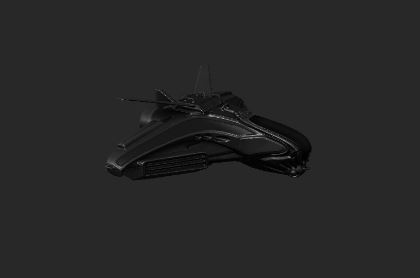
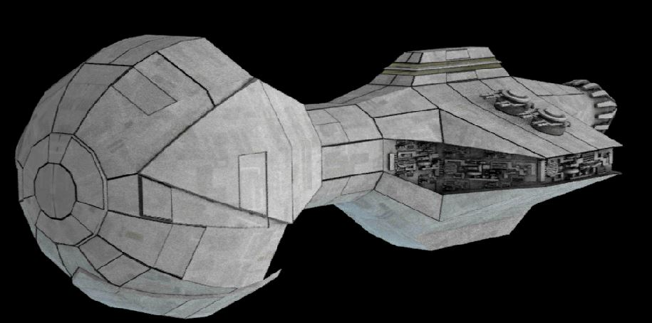
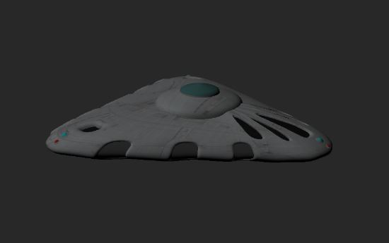

# Games Engine 2


# Spaceships AR
## Spaceships Models

IntergalacticSpaceship:


Cargo Ship


Mother ship:



## Story Board
"As the cargo ship transports goods from the far end of the earth to the other end Intergalactic spaceships swarm to its location to claim the cargo for them selves.""

## AR Foundation
### Unity AR Core

```
  AR Session Origin
    AR Camera / Main Camera
  AR Session


## Steering Behaviours

```
  Boid
  Arrive
  Seek

  Pursue
  Evade

  Follow path

  Wander
  Offset Pursue
```
```
Use this for a link: [janseludoGit](https://github.com/janseludo/Games-Engine-2)
